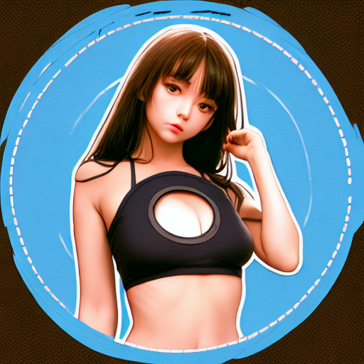
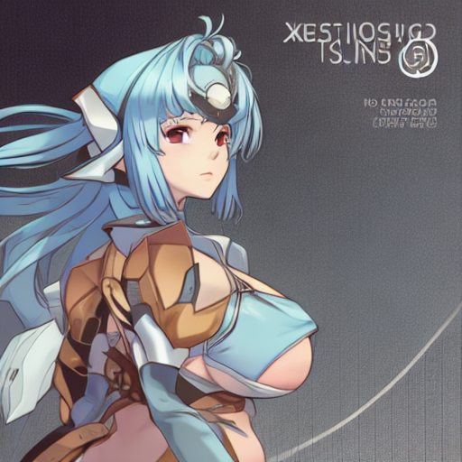
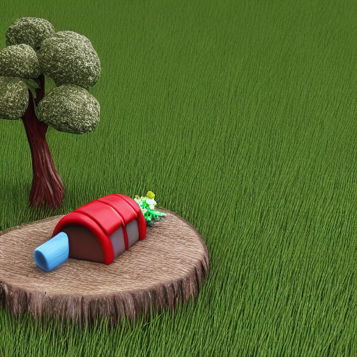
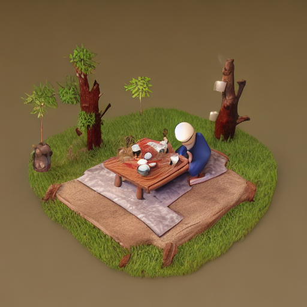
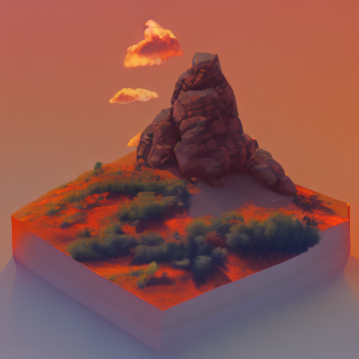

# 一个简单的Lora轮子

这是一个简单的Lora轮子，目标是使用最少的代码，实现一个可以进行训练，持久化的微型Lora训练框架
 注意：结果并不兼容webUI以及其他框架 

## 环境说明

代码的目标是尽可能的关注Lora的实现，以最少的代码实现一个可用的Lora，所以整个代码是以**huggingface**的**diffusers**库进行开发的，所需要的环境依赖见 requirements.txt 

 不支持SDXL 

## 运行

训练以及推理的代码主要在trainLora.py中

数据放置到自定义路径，数据使用文本图像对的形式（sd-scripts的数据可以直接使用）

## 效果

运行效果基于 runwayml/stable-diffusion-v1-5 与 非diffusers模型 。
代码重点是为了用最少的编码实现可用的训练，用于明晰原理，不过分追求效果

|diffusers|prompt|  角色/类型  |  原模型   |  Lora   |
|--------|---------|----------|-----------|-----------|
|否|1girl, circle_cut, clothing_cutout, cover, letterboxed, medium_breasts, pillarboxed|KOSMOS||
|是|small_scene, 3D_scene, grass, tree_stump, picnic, faux_figurine|scene|||
|否|small_scene, 3D_scene, sunset, mountain, cloud, gradient_sky, twilight, orange_sky, evening, red_sky|scene||

